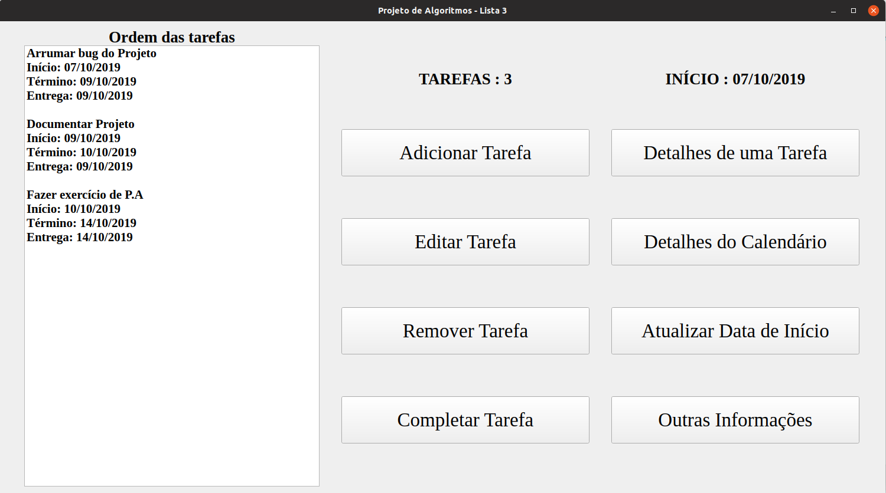
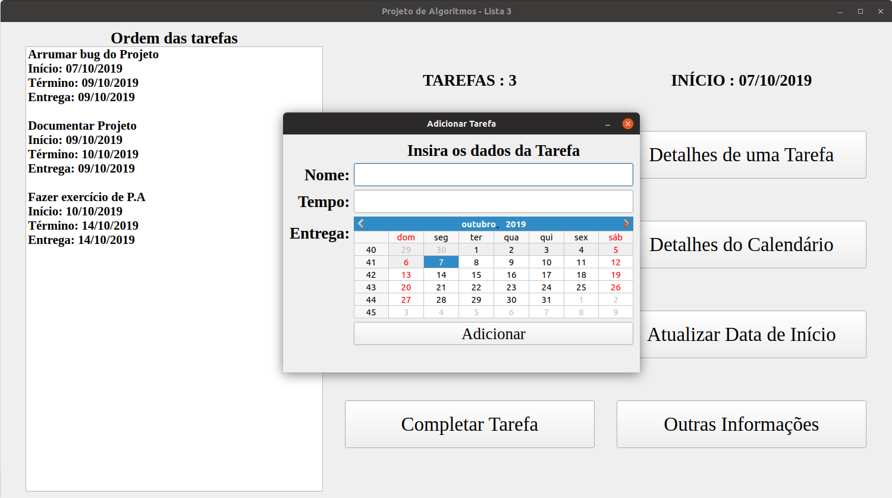
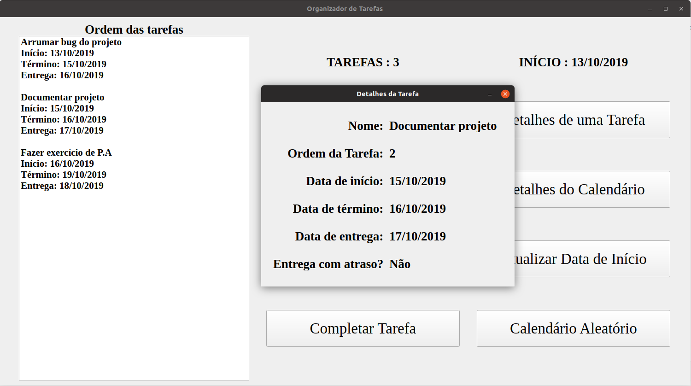

# Organizador de Tarefas

**Número da Lista**: 3<br>
**Conteúdo da Disciplina**: Programação Dinâmica<br>

## Alunos
|Matrícula | Aluno |
| -- | -- |
| 17/0050394  |  Henrique Martins de Messias |

## Sobre 
O software deste repositório é um <b>Organizador de Tarefas</b>.

## Screenshots






## Instalação 
**Linguagem**: C++<br>
Seu dispositivo deve ter o Qt5 instalado. Para fazer isso, utilize os seguintes comandos:

```bash
    $ sudo apt-get install build-essential
    $ sudo apt-get install qt5-default
```

## Uso

No terminal, vá até o diretório do exercício, que contém, além de arquivos como o README, a pasta "SMT".

Digite o seguinte comando:

  ```bash
    $ cd SMT
    $ qmake
  ```

Para compilar o código, digite:

  ```bash
    $ make
  ```

Para executar o código, digite:

  ```bash
    $ ./SMT
  ```

## Outros

Cada tarefa possui os seguintes dados:
 - Nome
 - Tempo (tempo, em dias, necessário para completar a tarefa)
 - Deadline (data de entrega)
 - Inicio (data em que a pessoa vai iniciar a tarefa)
 - Termino (data em que a pessoa vai terminar a tarefa)

O software armazena as tarefas em um vetor, atualizando conforme o usuário adiciona, edita, remove e completa tarefas.

 O usuário possui as seguintes opções:
  - Adicionar Tarefa (o usuário insere o nome, o tempo e a data de entrega da tarefa)
  - Editar Tarefa (o usuário insere o nome da tarefa e, então, coloca as novas informações)
  - Remover Tarefa (o usuário insere o nome da tarefa e o sistema a remove)
  - Completar Tarefa (o sistema remove a primeira tarefa)
  - Detalhes de uma Tarefa (o usuário insere o nome da tarefa e o sistema informará os dados dela)
  - Detalhes do Calendário (o sistema informará alguns dados do calendário, como quantidade de tarefas e atrasos)
  - Atualizar data de Início (a data de início é sempre a data de hoje, mas o usuário pode alterá-la)
  - Outras Informações (informações sobre o programa)